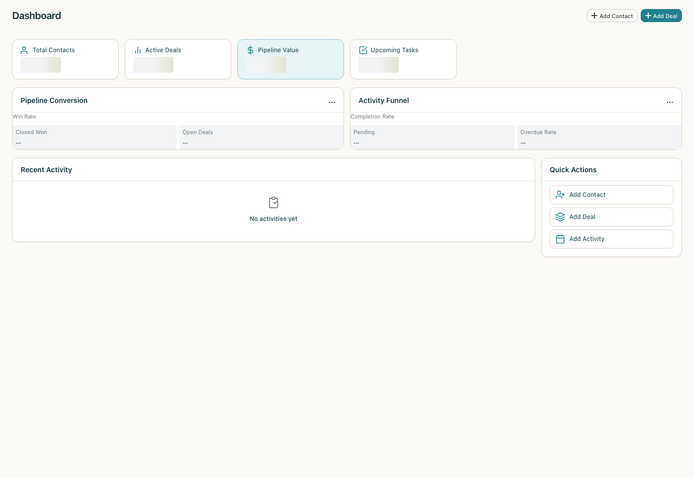
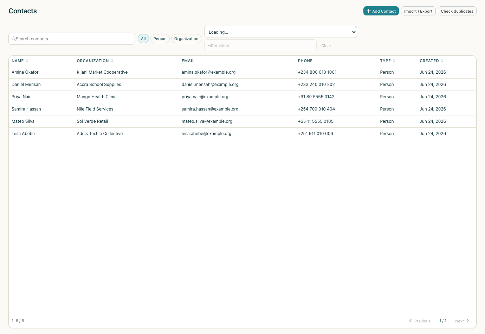
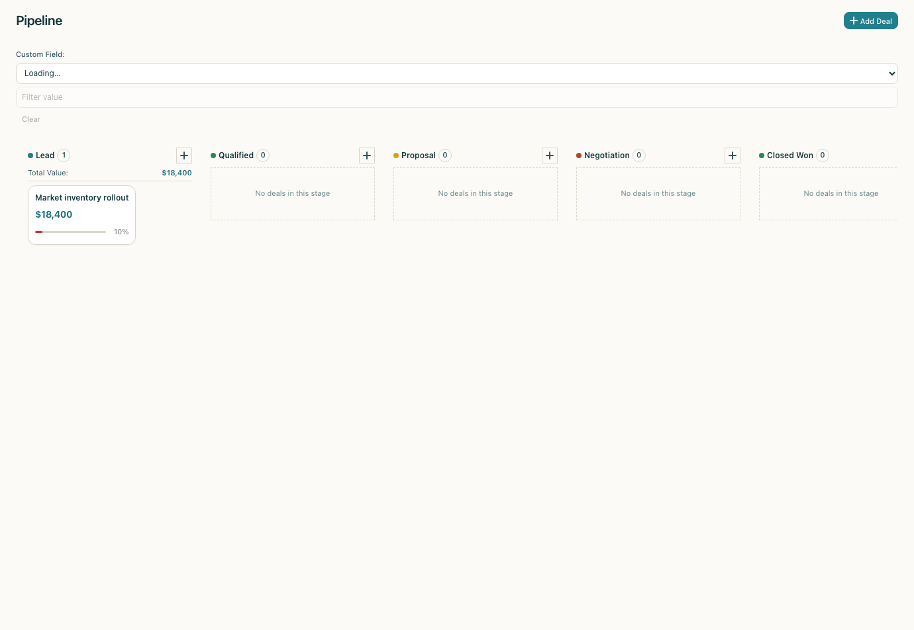
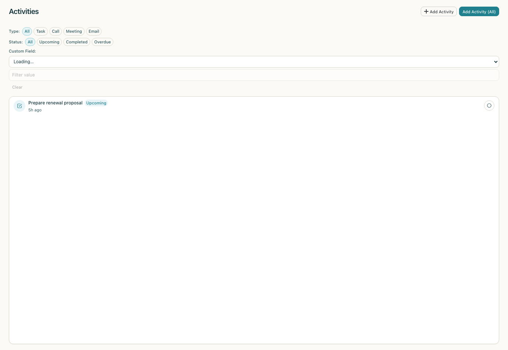
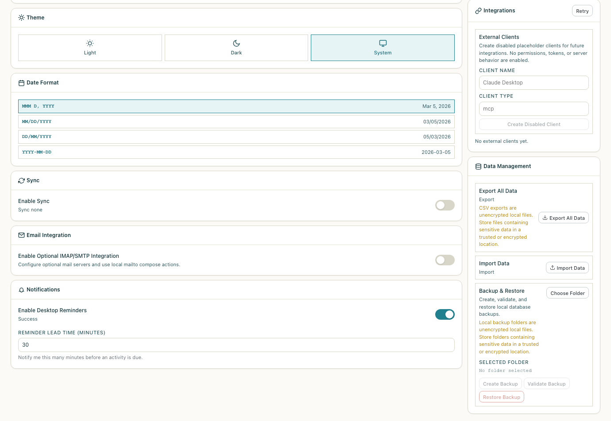

```
  ___   ___   ___  _____  ____  __  __
 / _ \ / _ \ / _ \|  ___||  _ \|  \/  |
| (_) | | | | | | | |_   | |_) | |\/| |
 \__, | |_| | |_| |  _|  |  _ <| |  | |
   /_/ \___/ \___/|_|    |_| \_\_|  |_|

  Offline-first CRM for developing nations.
```

[](https://opensource.org/licenses/Apache-2.0)
[](https://github.com/900Labs/900CRM/actions)
[](docs/RELEASE.md)
[](https://github.com/900Labs/900CRM#language-support)
[](CONTRIBUTING.md)
[](CODE_OF_CONDUCT.md)

---

## The 900 Mission

> 900 Labs is building enterprise-grade open source tools for the **900 million+ people** in developing economies who are priced out of the software that modern businesses depend on.

A small business in Lagos pays the same $50/seat/month for CRM software as a Fortune 500 company in New York — but operates in an economy where the average monthly salary is $150. A sales team in Nairobi needs the same pipeline management tools as one in London, but cannot afford $25/user/month for software that breaks the moment the internet drops.

AI has made it possible to build production-quality software at a fraction of the traditional cost. We believe that advantage should flow to the people who need it most — not just to those who can already afford it.

Every tool we release is **free and open source** under permissive licenses. No freemium traps, no usage limits, no surprise paywalls. **If we build it, you own it.**

Learn more at [900labs.com/impact](https://www.900labs.com/impact).

---

## What is 900CRM?

900CRM is the second tool from [900 Labs](https://www.900labs.com) — a free, open-source desktop CRM (Customer Relationship Management) application designed to work entirely offline. No internet connection required, ever. Built with [Tauri v2](https://tauri.app/) (Rust) and [Svelte 5](https://svelte.dev/), it targets Windows, macOS, and Linux with low hardware requirements. Pre-built release installers are not published yet; see [Release Readiness](docs/RELEASE.md), the [Alpha Readiness Audit](docs/ALPHA_READINESS.md), and the [Product Review and Competitive Benchmark](docs/PRODUCT_REVIEW_AND_BENCHMARK.md) for the current status.

900CRM is built especially for:
- **Small businesses and entrepreneurs** in regions with unreliable connectivity
- **Sales teams and field representatives** who work offline or in areas with metered data
- **NGOs and non-profits** that need contact management without cloud subscriptions
- **Schools, clinics, and government offices** that require local data sovereignty
- **Anyone** who wants a capable CRM that doesn't cost anything and doesn't phone home

Your business data stays on your device. Nothing is ever uploaded anywhere.



---

## Current Status

The source app is version `0.9.0`: a strong local-first CRM foundation, but
not a published 1.0 installer and still thinner than established CRMs in
daily-work depth. The current product-depth review is tracked in
[Product Review and Competitive Benchmark](docs/PRODUCT_REVIEW_AND_BENCHMARK.md).

Use [Documentation Index](docs/README.md) as the starting point for current
project docs. Historical `docs/sprint_*.md` files remain as audit records, but
they are not the best source for current product truth.

---

## Features

### Contacts
Manage your full network of people and organizations. Add custom fields, tag contacts, write notes, and store a website URL. Search across your entire contact database instantly.



### Pipeline
Visual kanban-style deal pipeline with drag-and-drop stages. Track every deal from first contact to close. See the total value of your pipeline at a glance. Customize stages to match your sales process.



### Activities
Link tasks, calls, meetings, and follow-ups to any contact or deal. Set due dates and receive desktop notifications. Never miss a follow-up again. Activity history gives you a complete timeline of every interaction.



### Dashboard
At-a-glance business metrics on every launch: pipeline value, deals by stage, upcoming tasks, recently modified contacts, and activity completion rates. No configuration needed — it works out of the box.

### Search
Full-text search across contacts, deals, and activities. Instant results as you type. Filter by entity type, date range, or tag. Works 100% offline — every search query stays on your machine.

### Import / Export
Bring your existing data in with local CSV or JSON import for contacts, deals, activities, organizations, generic notes, tags, and custom field definitions, including supported custom field values for flat CRM records. Export supported data sets, including audit logs, to CSV or JSON for use in spreadsheets, accountability review, accounting tools, or data migration. See [Import and Export](docs/IMPORT_EXPORT.md) for the current formats, export-only audit log semantics, local-ID note/tag semantics, duplicate preflight behavior, rollback options, and known gaps.

### Backup / Restore
Create local SQLite backups from Settings, validate backup integrity before restore, and restore only after explicit confirmation. See [Backup and Restore](docs/BACKUP_RESTORE.md) for the safety workflow.



### Internationalization (i18n)
The entire interface is localized. Switch languages in settings instantly. Full right-to-left (RTL) layout support for Arabic and future RTL languages. Community translations welcome.

### Offline-First by Design
Every core CRM feature works without an internet connection. There is no "offline mode" to enable because offline is the default. Sync configuration and changelog foundations exist for future team workflows, but real multi-device sync transport is not implemented today: `trigger_sync` explicitly reports a `not_implemented` state rather than claiming a successful sync.

### MCP Readiness
MCP support is optional and is not started by the desktop app today. `crates/crm-mcp` now has a disabled-by-default local stdio boundary for reviewed read tools plus `create_activity_draft` pending-action creation; it is not a network server, token surface, AI agent, or direct write runtime. See [MCP Readiness Baseline](docs/MCP_READINESS.md) for the current boundaries and future acceptance checklist.

---

## Why 900CRM?

**The cost barrier is real.**
SaaS CRM pricing ranges from $14 to $500 per user per month. In Sub-Saharan Africa, software is 10–13% more expensive than in the US in purchasing power terms. An ERP system in Kenya can cost three times the price of a basic computer. For millions of small businesses, CRM software is simply not affordable.

**Connectivity cannot be assumed.**
Fixed broadband in Sub-Saharan Africa costs over 20% of per capita income. Mobile data is expensive and unreliable in many regions. Every existing open-source CRM — SuiteCRM, EspoCRM, Odoo, Vtiger — requires a server and constant internet access. None of them work offline-first on the desktop.

**Existing tools leave a gap nobody fills.**

| Tool | Critical Gap |
|---|---|
| Salesforce, HubSpot | $25–$500/user/month, requires internet, cloud-only |
| SuiteCRM | Requires server + technical setup, no offline mode, dated UI |
| EspoCRM | Still requires server, no offline mode |
| Odoo | Free version very limited, complex setup, heavy resources |
| Vtiger | Best features cloud-only, self-hosting requires expertise |

900CRM fills the gap: a **capable, beautiful CRM that works on a $200 laptop with no internet connection and no server** — and costs nothing to use.

**Your data belongs to you.**
There is no account to create, no telemetry, and no analytics. Your contacts, deals, and business relationships live in a SQLite database on your machine. You can back it up with the Settings data-management tools, copy it to a USB drive, move it to a new computer, or inspect it with any SQLite tool. See [Privacy](docs/PRIVACY.md) for local-data caveats and [Backup and Restore](docs/BACKUP_RESTORE.md) for the local backup workflow and restore safety checks.

---

## Tech Stack

| Technology | Role | Why we chose it |
|---|---|---|
| [Tauri v2](https://tauri.app/) | Desktop shell & native OS integration | Rust-based, ~3 MB binaries (vs. 150+ MB for Electron), no bundled browser engine |
| [Rust](https://www.rust-lang.org/) | Backend logic, data engine, IPC | Memory-safe, fast, compiles to native code on all platforms |
| [Svelte 5](https://svelte.dev/) | Frontend UI | Smallest runtime of any major framework, runes-based reactivity, no virtual DOM |
| [SQLite](https://www.sqlite.org/) | Local data storage | Zero-configuration, single-file database, handles millions of CRM records |
| [TypeScript](https://www.typescriptlang.org/) | Frontend type safety | Catches bugs at compile time, improves IDE support |

**Why not a web app or PWA?**
PWAs have limited offline write capabilities, especially on iOS. Service Worker caching does not handle complex relational data operations well. A native desktop app gives full filesystem access for data export/import, works on older systems without browser configuration, and is consistent with 900 Labs' philosophy: local-first, no cloud dependency.

---

## Quick Start

This section walks you through getting 900CRM running locally for development. Pre-built installers are not published yet, so current evaluation starts from source. See [Release Readiness](docs/RELEASE.md) for the release checklist and packaging gaps.

### Prerequisites

- **Node.js 20 or later** — [nodejs.org](https://nodejs.org/)
  - Verify: `node --version` → `v20.x.x` or higher
- **Rust stable 1.70 or later** — [rustup.rs](https://rustup.rs/)
  - Verify: `rustc --version` and `cargo --version`
- **Git** — [git-scm.com](https://git-scm.com/)

**Platform-specific dependencies:**

#### Linux (Ubuntu / Debian)

```bash
sudo apt update
sudo apt install -y \
  libwebkit2gtk-4.1-dev \
  build-essential \
  curl \
  wget \
  file \
  libssl-dev \
  libayatana-appindicator3-dev \
  librsvg2-dev \
  libgtk-3-dev
```

For other Linux distributions, see [Tauri prerequisites](https://tauri.app/start/prerequisites/).

#### Windows

1. Install [Microsoft C++ Build Tools](https://visualstudio.microsoft.com/visual-cpp-build-tools/) with the "Desktop development with C++" workload.
2. WebView2 is included with Windows 10 (1803+) and Windows 11. Older systems: install the [WebView2 Runtime](https://developer.microsoft.com/microsoft-edge/webview2/).

#### macOS

```bash
xcode-select --install
```

That is all. Rust handles the rest.

### Step-by-Step Setup

**Step 1 — Clone the repository**

```bash
git clone https://github.com/900Labs/900CRM.git
cd 900CRM
```

**Step 2 — Install Node.js dependencies**

```bash
npm install
```

**Step 3 — Run the fast checks**

```bash
npm run check
cargo check --workspace
```

These commands use the root npm and Cargo workspaces to validate the desktop frontend and Rust crates.

**Step 4 — Run in development mode**

```bash
npm run tauri -- dev
```

This starts the Svelte dev server with hot-reload, compiles the Tauri shell, and opens the 900CRM window from `apps/desktop`. Use `npm run dev` when you only need the frontend dev server, `npm run build` for the frontend production bundle, and `cargo test --workspace` for Rust tests.

**Browser smoke tests**

```bash
npm run test:e2e
```

The E2E smoke suite runs the Vite-rendered browser shell with Playwright Chromium and a test-only Tauri IPC shim. It verifies app-shell and hash-route rendering, but it does not automate native Tauri windows, native file dialogs, release packaging, sync transport, MCP runtime, or AI behavior.

---

## Release Status

900CRM does not currently publish pre-built installers or public GitHub release
artifacts. Current CI is verification-only; a separate manual release workflow
can build unsigned Windows, macOS, and Linux release-candidate packages with
per-platform checksums, release metadata, and an SPDX-shaped dependency
inventory.

The intended public release artifacts are:

| Platform | Artifact | Minimum target | Current status |
|---|---|---|---|
| **Windows** | `.msi` or `.exe` installer | Windows 10 (1803+) | Unsigned release-candidate workflow exists |
| **macOS** | `.dmg` disk image | macOS 11 Big Sur (Intel & Apple Silicon) | Deferred until Developer ID signing and notarization |
| **Linux** | `.deb` package | Ubuntu 20.04 / Debian 11 | Unsigned release-candidate workflow exists |
| **Linux** | `.AppImage` | Any modern Linux distribution | Unsigned release-candidate workflow exists |

See [Release Readiness](docs/RELEASE.md) for the manual verification checklist,
the guarded release-packaging workflow, generated checksums/SBOM metadata, and
the explicit not-yet-implemented signing, notarization, and publishing
boundaries. See the [Alpha Readiness Audit](docs/ALPHA_READINESS.md) for the
current-vs-remaining phase map.

---

## Language Support

900CRM is fully internationalized. Translations live in `apps/desktop/src/lib/i18n/` and can be contributed by anyone.

| Language | Code | Coverage | Status |
|---|---|---|---|
| English | `en` | 100% | Complete — base language |
| Arabic | `ar` | 100% | Machine-assisted — native review welcome (RTL layout supported) |
| Hausa | `ha` | 100% | Machine-assisted — native review welcome |
| Bengali | `bn` | 100% | Machine-assisted — native review welcome |
| French | `fr` | 100% | Machine-assisted — native review welcome |
| Hindi | `hi` | 100% | Machine-assisted — native review welcome |
| Portuguese (Brazil) | `pt` | 100% | Machine-assisted — native review welcome |
| Spanish | `es` | 100% | Machine-assisted — native review welcome |
| Swahili | `sw` | 100% | Machine-assisted — native review welcome |
| Vietnamese | `vi` | 100% | Machine-assisted — native review welcome |

All locales have 100% translation-key parity with the English base. Non-English
translations are machine-assisted and benefit from native-speaker review — see
the [Translation Guide](CONTRIBUTING.md#translation-guide) to contribute
corrections. The app falls back to English for any missing key.

To add a new language or improve an existing translation, see the [Translation Guide in CONTRIBUTING.md](CONTRIBUTING.md#translation-guide).

---

## Architecture Overview

900CRM uses a two-process model provided by Tauri:

```
┌────────────────────────────────────────────────────────────┐
│                      Operating System                       │
│                                                            │
│  ┌─────────────────────────┐  ┌────────────────────────┐  │
│  │   Rust Backend           │  │  WebView (UI)           │  │
│  │ apps/desktop/src-tauri   │◄─┤  apps/desktop/src      │  │
│  │ crates/crm-core          │  │  Svelte 5 / TS         │  │
│  │                         │  │                        │  │
│  │  • CRM Engine            │  │  • Dashboard           │  │
│  │  • Storage (SQLite)      │  │  • Contacts view       │  │
│  │  • Sync changelog        │  │  • Pipeline kanban     │  │
│  │  • IPC command server    │  │  • Activities feed     │  │
│  │  • Import/Export         │  │  • Search              │  │
│  │  • Backup/Restore        │  │  • Settings            │  │
│  └─────────────────────────┘  └────────────────────────┘  │
│            ▲                            │                   │
│            └──── Tauri IPC bridge ──────┘                   │
└────────────────────────────────────────────────────────────┘
                            │
                     SQLite database
                  (~/.local/share/900CRM/)
```

For a deep dive into the module structure, data flow, sync protocol, and design decisions, see [ARCHITECTURE.md](ARCHITECTURE.md).

Current implementation baselines are documented in [Data Model](docs/DATA_MODEL.md), [Import and Export](docs/IMPORT_EXPORT.md), [Privacy](docs/PRIVACY.md), [MCP Readiness](docs/MCP_READINESS.md), and [Release Readiness](docs/RELEASE.md).

---

## Project Structure

```
900crm/
├── apps/
│   └── desktop/
│       ├── src/                  # Svelte 5 frontend source
│       │   ├── lib/
│       │   │   ├── components/   # Reusable Svelte components
│       │   │   ├── stores/       # Svelte 5 rune-based state
│       │   │   ├── api/          # Tauri invoke wrappers
│       │   │   ├── i18n/         # Translation JSON files
│       │   │   ├── services/     # Frontend service helpers
│       │   │   └── utils/        # Shared frontend helpers
│       │   ├── routes/           # SvelteKit routes and route components
│       │   ├── app.css           # Global styles and design tokens
│       │   ├── app.d.ts
│       │   └── app.html
│       ├── src-tauri/            # Tauri shell and IPC command layer
│       │   ├── src/
│       │   │   ├── main.rs
│       │   │   ├── lib.rs
│       │   │   ├── state.rs
│       │   │   └── commands/     # Tauri command handlers
│       │   ├── capabilities/     # Tauri v2 permission definitions
│       │   ├── icons/            # App icons (all sizes)
│       │   └── tauri.conf.json   # Tauri build configuration
│       ├── package.json          # Desktop workspace scripts and deps
│       ├── svelte.config.js
│       ├── tsconfig.json
│       └── vite.config.ts
├── crates/
│   ├── crm-core/                 # Shared Rust CRM domain, storage, services
│   │   └── src/
│   │       ├── crm_engine/       # Business rules
│   │       ├── storage/          # SQLite access and sync persistence
│   │       ├── domain/           # Domain models
│   │       ├── services/         # Application services
│   │       ├── search/           # Search support
│   │       └── import_export/    # CSV import/export support
│   ├── crm-mcp/                  # Optional local MCP stdio boundary
│   └── crm-sdk/                  # Read-only local SDK facade
├── scripts/                      # Root verification and release metadata helpers
├── plugins/                      # Community plugin directory
│   └── README.md                 # Plugin development guide
├── docs/                         # Required public docs and sprint notes
│   ├── DATA_MODEL.md             # Current local schema/model baseline
│   ├── IMPORT_EXPORT.md          # Current CSV import/export behavior
│   ├── PRIVACY.md                # Offline-first privacy and caveats
│   ├── MCP_READINESS.md          # Current optional-MCP readiness boundary
│   ├── RELEASE.md                # Current release status and future artifact checklist
│   └── BACKUP_RESTORE.md         # Local backup and restore workflow
├── samples/                      # Synthetic CSV data for manual import smoke tests
├── .github/
│   ├── workflows/
│   │   ├── ci.yml                # Ubuntu PR and main-branch verification
│   │   └── release.yml           # Manual release-candidate packaging workflow
│   └── pull_request_template.md  # Pull request checklist and guardrails
├── ARCHITECTURE.md               # Technical architecture guide
├── CHANGELOG.md
├── CODE_OF_CONDUCT.md
├── CONTRIBUTING.md
├── LICENSE
├── README.md                     # You are here
├── SECURITY.md
├── Cargo.toml                    # Rust workspace manifest
├── package.json                  # Root npm workspace scripts
├── package-lock.json
└── playwright.config.ts
```

---

## Contributing

We welcome contributions from everyone — whether you are fixing a typo, translating the app into your language, writing a test, or building a new feature.

Please read [CONTRIBUTING.md](CONTRIBUTING.md) for full details on how to get started. If you have never contributed to an open-source project before, that document is written especially for you.

**Good First Issues:** Look for issues tagged [`good first issue`](https://github.com/900Labs/900CRM/issues?q=is%3Aissue+is%3Aopen+label%3A%22good+first+issue%22) on the issue tracker — well-scoped tasks that don't require deep knowledge of the codebase.

---

## Roadmap

### Current Implementation Baseline
- [x] Contacts management with custom fields and tags
- [x] Visual kanban pipeline with drag-and-drop
- [x] Activities: tasks, calls, meetings
- [x] Dashboard with at-a-glance metrics
- [x] Full-text search across all entities
- [x] CSV import and export
- [x] 10 languages (EN, FR, ES, AR, SW, HI, PT, VI, HA, BN)
- [ ] Windows, macOS, Linux release installers (major remaining alpha gap; see [Alpha Readiness Audit](docs/ALPHA_READINESS.md))

### Completed App Foundations
- [x] Custom fields on any entity type
- [x] Reports and conversion funnels
- [x] Desktop reminders and notifications
- [x] Multi-currency display
- [x] Local backup validation and restore UI
- [x] Additional languages: Portuguese (Brazilian), Vietnamese
- [x] Additional languages: Hausa, Bengali

### In Progress
- [ ] Email server connection test (SMTP/IMAP TCP reachability/banner probe only; full send/receive is not implemented)

### v2.0.0 — Planned (Long-term)
- [ ] Plugin system for community extensions
- [ ] Optional multi-device sync (self-hosted server)
- [ ] Mobile companion app (Tauri mobile)
- [ ] Quotes and invoice generation (PDF output)
- [ ] WhatsApp integration for business communication

---

## Community

- **Discussions:** [github.com/900Labs/900CRM/discussions](https://github.com/900Labs/900CRM/discussions) — ask questions, share ideas, show what you have built
- **Issue Tracker:** [github.com/900Labs/900CRM/issues](https://github.com/900Labs/900CRM/issues) — report bugs, request features
- **Security:** See [SECURITY.md](SECURITY.md) for how to report vulnerabilities privately

---

## 900 Labs Ecosystem

900CRM is part of the growing 900 Labs open infrastructure suite:

| Tool | Description | Status |
|---|---|---|
| [900PDF](https://github.com/900-labs/900pdf) | Offline-first PDF viewer and editor | Released |
| **900CRM** | Offline-first CRM for developing nations | Release readiness in progress |
| More coming | Accounting, invoicing, inventory — and more | Planned |

Every tool in the 900 Labs suite shares the same principles: offline-first, local data, permissive license, no cloud dependency.

Visit [900labs.com](https://www.900labs.com) to learn more.

---

## License

900CRM is licensed under the **Apache License, Version 2.0**.

This means you are free to use, modify, and distribute 900CRM for any purpose — including commercially — as long as you include the license notice. The Apache 2.0 license also includes an explicit patent grant from all contributors.

See the full [LICENSE](LICENSE) file for details.

---

## Acknowledgments

900CRM stands on the shoulders of outstanding open-source projects:

- **[Tauri](https://tauri.app/)** — the framework that makes small, fast, secure desktop apps possible
- **[Svelte](https://svelte.dev/)** — a frontend framework that respects the user's hardware
- **[SQLite](https://www.sqlite.org/)** — the world's most deployed database, public domain, the right choice for local-first software
- **[Rust](https://www.rust-lang.org/)** — a language that makes systems programming safe and accessible

Most importantly, this project is dedicated to the entrepreneurs, sales teams, NGO workers, and small business owners in communities with limited connectivity who deserve the same quality tools as anyone else. You are not an afterthought — you are the reason this exists.
